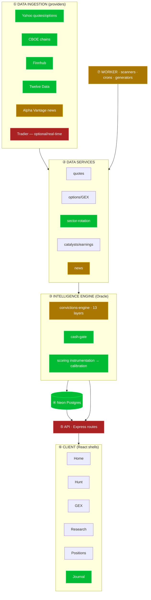

# QuantEdge — Systems Blueprint (rebuild on a solid foundation)

Companion to `AUDIT.md` (what to cut). This is the **systems-engineering view**:
the layers, the linkages, and the head-to-toe build order — using **MomoEdge as
the reference template**.

---

## 1. The template — what "good" looks like (MomoEdge)
MomoEdge is **one product**: the **Terminal**, four connected modules, wrapped in a
lean marketing site. Their whole thesis:

> *"The problem isn't a lack of data — it's a lack of context. Charts, positioning,
> flow, and regime are viewed in isolation. We connect them into one decision process."*

| MomoEdge module | Does |
|---|---|
| **PULSE** | Reads the market — regime, sector **rotation (RRG)**, relative strength, historical context |
| **PRISM** | Maps **positioning** — gamma / dealer exposure |
| **FLOW** | Finds the **activity** — unusual options flow |
| **HEATMAP** | Shows **where it lands** |
| **Oracle** | AI/analyst layer that interprets it all (+ a Premium Discord community) |

IA: `Landing → Terminal (Pulse · PRISM · Flow · Heatmap) · Pricing · Blog · Changelog · Feedback · Login`.
Model: $70/mo platform · $150/mo Premium (Terminal + community) · 7-day trial · waitlist/waves.

**The lesson: one surface, a few modules that feed each other, an AI layer on top.**

---

## 2. QuantEdge decomposed into subsystems (current state)

**Health of each layer** (from this session):
1. **Data** — 🟢 solid (multi-source w/ CBOE/Yahoo fallback). 🔴 Tradier real-time is premium-gated; 🟡 AV news rate-limited.
2. **Services** — 🟢 rotation is accurate & verified. 🟡 catalysts thin, news empty on free tier.
3. **Engine** — 🟡 the 13-layer grade is **not yet predictive** (calibration proved it); instrumentation now records layer→outcome to fix it. Cash-gate ✅.
4. **DB** — 🟢 recovered, schema-synced, on `ep-dark-cherry` (Neon). *Guardrail: disable branch archiving.*
5. **API** — 🔴 763 endpoints in one 28k-line file; most have no client caller. The biggest structural debt.
6. **Client** — 🟢 6 clean shells exist… 🔴 buried under ~120 routes (see AUDIT.md).
7. **Worker** — 🟡 generation is cron-gated; catch-up added.

---

## 3. The map: QuantEdge already IS MomoEdge (just disconnected)
| MomoEdge | QuantEdge equivalent | State |
|---|---|---|
| PULSE | `sector-rotation` engine + Home shell | ✅ have it, accurate |
| PRISM | GEX shell + `gamma-exposure` | ✅ have it |
| FLOW | `options-flow-scanner` | ✅ have it (CBOE/Yahoo) |
| HEATMAP | heatmap pages (fragmented) | ✅ have it, scattered |
| Oracle | `convictions-engine` + AI ideas | ✅ have it (grade needs fixing) |
| — | **Hunt (ranked ideas)** | 🟢 your differentiator MomoEdge doesn't have |

**You don't need to build new modules. You need to connect the ones you have and delete the rest.**

---

## 4. The linkages (the "connected decision process")
This is the systems point — each module is a **layer feeding one engine**, not a separate page:
```
PULSE (rotation) ─┐   which sectors/tickers have capital flowing → universe
PRISM (gamma)    ─┤   where price is pinned/pushed → levels
FLOW             ─┼─▶ CONVICTIONS ENGINE (Oracle) ─▶ HUNT (ranked ideas)
CATALYST/CASH-GATE┤   when (event risk) → dampens the grade                └▶ RESEARCH (per-ticker deep dive)
TECHNICAL        ─┘   structure → entry/stop/target
```
Every arrow already exists as a **layer in the convictions engine** — which is exactly
why the scoring instrumentation matters: it proves *which linkages actually predict*,
so you reweight on evidence instead of vibes.

---

## 5. Head-to-toe build order
1. **Foundation** — data + DB + schema. *Mostly done this session* (DB recovered, feeds have fallbacks). Finish: disable Neon archiving, one env source of truth, Railway deploy.
2. **Engine (Oracle)** — convictions + instrumentation + calibration. *In progress* — let it collect ~2–4 wks of clean data, then reweight the layers so the grade means something.
3. **Terminal IA** — collapse 120 routes → **one Terminal** with the 6 modules as tabs/panels (Pulse · GEX/PRISM · Flow · Hunt · Research · Positions). This IS the AUDIT.md cull, finished.
4. **API diet** — split the 28k-line `routes.ts`, delete endpoints with no client caller, group the rest by module.
5. **Oracle + community** — surface the AI synthesis prominently; optional Discord/Premium tier like MomoEdge.
6. **Shell** — lean landing · pricing · waitlist/access · changelog. Marketing last, product first.

## 6. Cut/keep
See `AUDIT.md`. Phase 1 (48 dead routes) is done. Phase 2 is the file/component/service
orphan sweep — safe only with codebase-wide dependency checks + build verification per batch.

---

### The one-sentence version
QuantEdge has every piece MomoEdge has, plus Hunt — it's just spread across 120 pages
and 763 endpoints instead of one connected Terminal. **The work isn't building; it's
deleting, connecting, and proving the engine.**

---

## 7. MomoEdge design & product language (the target feel)
From the live site + changelog — the things that make it feel premium, and where
QuantEdge already has the substance:

| MomoEdge piece | What it is | QuantEdge already has |
|---|---|---|
| **Oracle Orb** | central regime centerpiece — risk-on / transition / downtrend; set bias *before* tickers | `marketContext.regime` + `sector-rotation` (needs the orb visual) |
| **RRG Rotation Map** | sectors on **relative-strength (x) × momentum (y)** quadrants, bubble-sized, quadrant-colored | `/api/sector-rotation` returns `relChange` + `fiveDayChange` — **the exact inputs.** Missing only the chart |
| **Signal Stream** | ranked signal feed, score-sorted, expandable cards | **Hunt** (ranked convictions) |
| **PRISM** | strike × expiration matrix · GEX/VEX/OI/VOL/Unusual lenses · SPX·SPY·QQQ confluence · ★Heat Seeker auto-pick | GEX **Matrix** + **Spectrum** scanners |
| **Flow Feed** | flow w/ filter panel, sort by premium/expiry, saved views | `options-flow-scanner` |
| **GEX bars** | Wall / Support / Magnet / Trigger, click-to-highlight strike | GEX engine |
| **Momo** | AI tutor built into every tab, answers follow-ups | AI chatbot exists; not tab-contextual yet |
| **Changelog cadence** | ships small, visible, weekly — public changelog + blog | none (start one) |

**Signal aesthetic:** MomoEdge presents a trade idea as a **terminal/code readout**
(`INIT_SIGNAL(...)`, monospace, syntax-highlighted fields, `BREAKOUT_CLASS`, memory log).
That "AI oracle spoke it" voice is brand, and it's cheap — a card component, not new data.

**Takeaway:** the gap to MomoEdge is **presentation + connection + shipping discipline**,
not capability. Build order stands: excavate → connect → present in the Oracle/RRG/PRISM voice.
