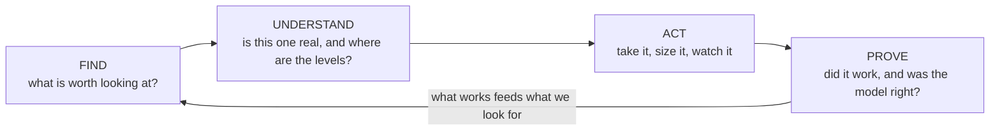
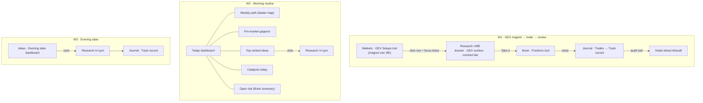
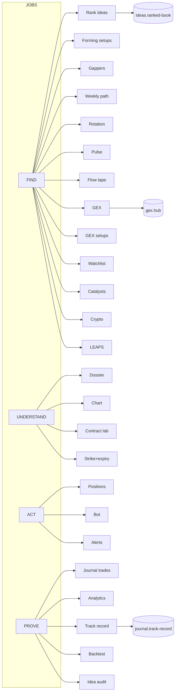
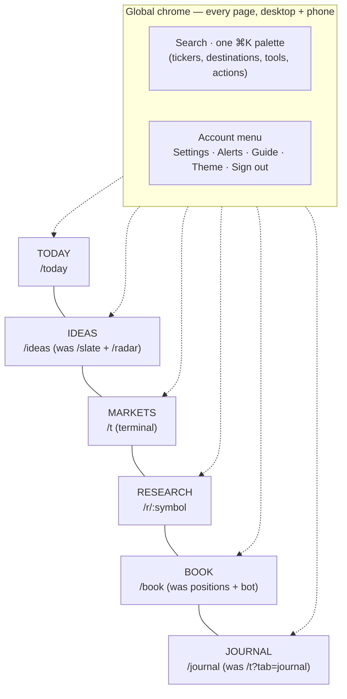
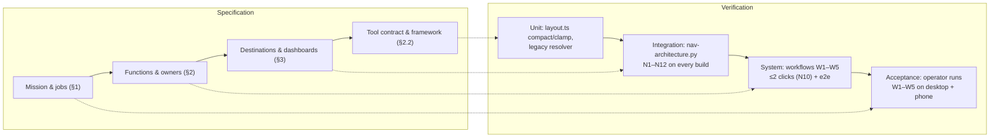

# QuantEdge — Information Architecture: a top-down system design

Status: **Phase 1 implemented** on `feat/ia`; **Phase 2 framework + terminal dashboards** on `feat/dash` (2026-09-29, see docs/TOOLS_MIGRATION.md). Phases 2–5 are specified here and depend on in-flight branches (see §5.3).
Owner instrument: `research/nav-architecture.py` (the automated V-model checks in §4) + `research/check-legacy-redirects.ts`.

The operator's brief: *"I love how the flow page works with moving and resizing — can we make the whole platform like that; we need to reduce redundancy; check all pages in the navs, think like a systems engineer, top-down: are things flowing how they should and are things where they should be."*

This document answers it in the order a systems engineer would: **mission → jobs → functions → one owning tool per function → destinations that are dashboards of tools → workflows → requirements → tests → migration.**

---

## 0. Where we are (baseline, measured 2026-09-29)

| Measure | Before this pass | After Phase 1 |
|---|---|---|
| Routes in `App.tsx` | 38 | 37 (`/nexus-prototype` → redirect) |
| Terminal tabs / Journal views / Research tabs | 10 / 4 / 3 | unchanged (Phase 2 turns them into dashboards) |
| Dead page files | 5 (~7.75k lines) | 0 (+16 components/libs only they used — ~2.3k more lines) |
| Broken references | 10 | 1 remaining (terminal market-focus overlay — in the terminal branch's file, allowlisted in N12) |
| Legacy URLs that drop their tab | ~12 | 0 (26 checked by N9) |
| Functions served by >1 surface | 19 of 29 | 19 of 29 (Phases 2–4 take this to 0) |
| Chart implementations | 51 (8 sparklines, 3 rotation quadrants…) | unchanged (Phase 4) |

Nothing in the product is *missing*; the problem is that the same job is done in 2–4 places with different numbers, and some doors lead nowhere. That is an architecture problem, not a feature problem, so the fix is structural: **one owner per function, many placements.**

---

## 1. Mission and the four user jobs

**Mission.** Help one discretionary options/equity trader find a measured edge, understand it well enough to size it, act on it, and prove afterwards whether it worked — with every number traceable to a live source.

Every screen serves exactly one of four jobs. They form a loop, not a menu:



| Job | Question the trader is asking | Evidence it needs |
|---|---|---|
| **FIND** | "What should I look at right now / tomorrow?" | Ranked ideas, forming setups, gappers, flow leaders, GEX magnets, catalysts |
| **UNDERSTAND** | "Is this one real? Where are the levels? Which contract?" | Per-ticker dossier: chart, dealer positioning, flow, options chain, events |
| **ACT** | "Take it, size it, get told when it moves." | Positions, risk, alerts, bot/paper execution |
| **PROVE** | "Did it work? Is the model honest?" | Journal, analytics, track record, per-idea audit trail, backtest |

### 1.1 The operator's real workflows

| # | Workflow | Steps (job) | Today's path | Target path (§3) |
|---|---|---|---|---|
| **W1** | Spot a BE-style GEX magnet → research the ticker → take the trade → review it | FIND → UNDERSTAND → ACT → PROVE | `/t?tab=gex` (Screener) → `/r/BE` → `/t?tab=positions` → `/t?tab=journal` | **Markets** (GEX Setups tool, click row) → **Research** `/r/BE` → **Book** → **Journal** |
| **W2** | Morning routine (8:00–9:30 ET) | FIND → ACT | `/today` → `/t` → `/radar` → `/t?tab=positions` | **Today** (one dashboard: weekly path, gappers, top ideas, catalysts, open risk) — zero navigation |
| **W3** | Evening slate (after the close) | FIND → UNDERSTAND → PROVE | `/slate` → `/r/:sym` → `/t?tab=journal&jtab=record` | **Ideas** › "Evening slate" dashboard → Research → Journal |
| **W4** | Check an idea's evidence before trusting it | PROVE → ACT | *(no link existed)* | **Today/Ideas** idea → "Audit trail" (`/trade-ideas/:id/audit`) — linked from Today in Phase 1 |
| **W5** | Tape reading intraday | FIND → UNDERSTAND | `/t?tab=flow` → `/t?tab=chart` → `/r/:sym` | **Markets** › Flow dashboard (Options Flow + Stock Chart side by side, focused ticker shared) → Research |



---

## 2. Functional decomposition

**Jobs → functions → tools → placements.**

- A **function** is one thing the system must do (e.g. "rank today's trade ideas").
- A **tool** is the single component that implements a function — a movable, resizable widget with a declared data source, units and age stamp. The Flow tab's tool registry (`components/flowdash/registry.tsx`, feat/flowdash) is the reference implementation of a tool.
- A **placement** is an instance of a tool on some dashboard, with its own size/config (e.g. "top 1, hero" on Today; "all, table" on Ideas).

**The redundancy rule: exactly one tool per function; any number of placements.** Four "what to trade" boards is a violation; one ranked-book tool placed on Today (top 5) and on Ideas (all) is not.



### 2.1 Function → owning tool → components that merge into it

This table is the source of truth that `nav-architecture.py` N6 mirrors (`FUNCTIONS`). "Current surfaces" > 1 is redundancy debt (N6b); the Phase column says when it reaches 1.

| Job | Function | Owning tool (one) | Current surfaces that merge into it | Phase |
|---|---|---|---|---|
| FIND | Rank today's trade ideas | `ideas.ranked-book` | Today "Ranked setups" + best idea (`pages/today.tsx`), NEXUS board (`pages/nexus-prototype.tsx` SignalGrid/SignalTable), Slate cards (`pages/slate.tsx`), Radar "Picks" (`pages/radar.tsx`, different engine → becomes a *source filter*) | 3 (Radar: 4) |
| FIND | Discover forming setups | `ideas.forming` | Radar "Forming", NEXUS forming rail | 3 |
| FIND | Pre-market gap read | `ideas.gappers` | `trade-desk/PreMarketGappersCard` (on Slate) | 2 |
| FIND | Market regime + weekly path | `markets.weekly-path` | Today dealer map (`/api/weekly-path`, `/api/gex-vex/terminal`) | 2 |
| FIND | Sector rotation | `markets.rotation` | Today `RotQuad`, `components/rotation-map.tsx` (terminal overlay — unreachable), landing `RotQuad` | 2 |
| FIND | Market pulse / leadership | `markets.pulse` | `oracle/oracle-market-field.tsx`, `oracle/session-brief.tsx` (both only in the unreachable overlay) | 2 |
| FIND | Options flow tape | `flow.options-flow` | flowdash Options Flow, workup flow block | 2 (flowdash) |
| FIND | Dealer positioning (GEX) | `gex.hub` | `/t?tab=gex` GexHub, `/r/:s` GEX surface (`research/terminal-heatmap`), flowdash GEX Chart | 3 |
| FIND | GEX setups / magnets | `gex.setups` | GexHub Screener (`gex-rankings-panel`), flowdash GEX Setups | 2 (flowdash) |
| FIND | Watchlist | `markets.watchlist` | NEXUS `WatchlistRail`, flowdash Watchlist | 2 |
| FIND | Catalysts / events | `markets.catalysts` | `/t?tab=catalyst` | 2 |
| FIND | Crypto transmission | `markets.crypto` | `/t?tab=crypto` | 2 |
| FIND | LEAPS theses | `ideas.leaps` | `/t?tab=leaps` | 2 |
| UNDERSTAND | Per-ticker dossier | `research.dossier` | `/r/:s` Dossier (`workup/ticker-workup`), terminal workup overlay | 3 |
| UNDERSTAND | Price chart | `research.chart` | `/t?tab=chart` Chart Lab (`chart-lab-nexus`), `FlowChartBoard` (`flow-chart-nexus`), workup chart | 4 (chart branch) |
| UNDERSTAND | Contract / chain analysis | `research.contract-lab` | `/r/:s` Contract lab (`contract-analyzer`), workup options | 3 |
| UNDERSTAND | Strike × expiry matrix | `gex.matrix` | `gex/gex-expiry-matrix`, `research/terminal-heatmap` | 3 |
| ACT | Open positions / risk | `book.positions` | `/t?tab=positions` (`pages/positions-heatmap`) | 2 |
| ACT | Automation / paper bot | `book.bot` | `/t?tab=bot` | 2 |
| ACT | Alerts | `book.alerts` | `/alerts` page, terminal Alerts drawer (`terminal/terminal-alerts`) | 3 |
| PROVE | Journal trades | `journal.trades` | Journal › Trades | 2 (journal) |
| PROVE | Journal analytics | `journal.analytics` | Journal › Analytics | 2 (journal) |
| PROVE | Track record (model) | `journal.track-record` | Journal › Track record (`pages/performance`), Radar "Track Record", Today "Model record" | 3 |
| PROVE | Backtest | `journal.backtest` | `pages/backtest`, `pages/strategy-simulator` | 4 |
| PROVE | Idea audit trail | `journal.idea-audit` | `/trade-ideas/:id/audit` | — (linked in Phase 1) |
| PLATFORM | Search / command palette | `platform.palette` | global `components/command-palette.tsx`, terminal `components/terminal/command-palette.tsx` | 3 (terminal branch) |
| PLATFORM | Account menu | `platform.account-menu` | NexusFrame menu, terminal menu | 3 (terminal branch) |
| PLATFORM | Preferences / settings | `account.settings` | `/settings`, terminal Preferences drawer (`terminal-settings`), `shell/customize-panel` | 3 |
| PLATFORM | Guide / how to use | `account.guide` | `/how-to`, terminal Guide drawer | 3 |

**Primitives (not functions, but the same rule).** 51 chart implementations collapse to one primitive each: `Spark` (8 today → `components/viz`), `RotationQuadrant` (3 → `markets.rotation`), `StrikeExpiryMatrix` (2 → `gex.matrix`), one price chart engine (chart branch). Phase 4.

### 2.2 The tool contract

Generalised from the flowdash `ToolDef` so every destination uses the same framework:

```ts
interface ToolDef {
  type: string;                 // 'ideas.ranked-book' — globally unique = the function's owner id
  job: 'FIND' | 'UNDERSTAND' | 'ACT' | 'PROVE' | 'PLATFORM';
  title: string; blurb: string;
  units: string; source: string; backing: string;   // provenance, shown in the tool header
  scope: 'global' | 'ticker';   // ticker tools follow the focused symbol (StockContext / URL on /r)
  ageInside?: boolean;          // live-not-carried: every tool stamps data age
  w: number; h: number; minW: number; minH: number; // 12-col grid cells
  configSchema?: {...};         // placement config: limit, view (table|cards|hero), filters
  Component: Lazy<ComponentType<{ config; focus }>>;
}
```

Shared context every tool reads, never owns: **focused ticker** (URL on `/r/:symbol`, `StockContext` elsewhere — a row click in any tool re-points it), **session clock**, **user**. Tools never navigate the shell except via `openResearch(sym)`.

---

## 3. Target information architecture

### 3.1 Six destinations + account menu



| # | Destination | URL (target) | Job | Default dashboard (tools, reading order) | Named dashboards / presets |
|---|---|---|---|---|---|
| 1 | **Today** | `/today` | FIND (morning) | `markets.weekly-path` · `ideas.gappers` (pre-market only) · `ideas.ranked-book` (top 5, hero) · `markets.catalysts` (today) · `book.positions` (summary) · `markets.rotation` · `journal.track-record` (summary) | Morning · Midday |
| 2 | **Ideas** | `/ideas` | FIND | `ideas.ranked-book` (all, table) · `ideas.forming` · `gex.setups` · `ideas.leaps` | Evening slate (ranked-book as cards + gappers) · Radar (forming + source=radar) |
| 3 | **Markets** | `/t` | FIND (intraday) | The flowdash grid generalised: named dashboards replace terminal tabs — **Flow** (current flowdash default), **GEX** (`gex.hub`, `gex.levels`, `gex.setups`), **Chart** (`research.chart` + levels), **Crypto**, **Catalysts**, **Pulse** (`markets.pulse`, `markets.rotation`, `markets.watchlist`) | user-created |
| 4 | **Research** | `/r/:symbol` | UNDERSTAND | ticker-scoped: `research.dossier` header · `research.chart` · `gex.hub` (scoped) · `gex.matrix` · `flow.options-flow` (ticker) · dark-pool · `research.contract-lab` · `journal.trades` (this ticker) | Dossier · GEX · Contract |
| 5 | **Book** | `/book` | ACT | `book.positions` · `book.alerts` · `book.bot` | — |
| 6 | **Journal** | `/journal` | PROVE | `journal.trades` · `journal.analytics` · `journal.track-record` · `journal.backtest` · `journal.idea-audit` (per idea) | Dashboard · Trades · Analytics · Track record (the journal branch's four views become four presets) |
| — | **Account menu** | `/settings`, `/how-to`, drawer | PLATFORM | Settings (profile · notifications · trading & risk · bots · display & layout), Guide, Theme, Alerts shortcut, Sign out | — |

**Every destination is a dashboard.** The user can **move, resize, add (from a job-grouped catalogue), remove** tools and **Restore defaults**. Named dashboards are per user. Defaults carry a `defaultsVersion`; when we ship a better default, users who never customised get it, users who did get a one-line "new default available — apply?".

**Phones** (< 768 px): dashboards render as a single column in layout order (stack, never hide); editing is a list with reorder/remove, no free drag or resize. Search is an icon in the topbar that opens the same palette full-width.

**Search.** One palette on every page (framed pages *and* the terminal): tickers (universal `/api/search/symbols`), the six destinations (⌘1–⌘6 in job order), named dashboards, tools ("add GEX Setups to this dashboard"), and actions. Enter on a ticker → `/r/:symbol`.

### 3.2 Persistence

Reuse the flowdash mechanism: `/api/user/:userId/layouts` (`user_page_layouts`), one row per dashboard, `pageId = <destination>:<dashboardId>` (`today:default`, `markets:flow`, …), device copy in `localStorage` for signed-out viewers, header states where it is saved. **Retire `/api/navigation-layout`** — it stored a sidebar layout nothing read (the Settings › Navigation tab removed in Phase 1 was its only client).

---

## 4. Requirements and verification (V-model)



| Req | Requirement | Test (automated) | Status after Phase 1 |
|---|---|---|---|
| R-NAV-1 | No link leads nowhere | **N1** dead links (+ dead `?tab=` on `/t`) | PASS |
| R-NAV-2 | Every page has a door; no orphan page files | **N3** orphan page files (import graph from `main.tsx`), **N4** unreachable routes | PASS |
| R-NAV-3 | Chrome lists (publicPages, full-bleed, skipPaths) name only real routes | **N7** | PASS |
| R-NAV-4 | Search + ⌘K on every page, desktop and phone | **N11** (NexusFrame + terminal both have desktop and phone triggers) | PASS. Phase 3 adds N11b: exactly one palette implementation mounted |
| R-NAV-5 | No panel that can never open | **N12** dead UI state (setter only ever called with null/false) | PASS with 1 allowlisted item (terminal `marketFocus`, Phase 2) |
| R-FN-1 | Exactly one owning tool per function | **N6** registry: every function has one owner, no tool owns two | PASS (29 → 29) |
| R-FN-2 | No function served by two implementations | **N6b** redundancy debt | 19/29 → target 0 by end of Phase 4 |
| R-FN-3 | Every registered tool appears in ≥1 default dashboard | N13 (Phase 2: parse tool registry + defaults) | spec |
| R-FLOW-1 | Every operator workflow step reachable in ≤2 clicks from the previous step | **N10** (global chrome/palette or a direct link from the previous step's page) | PASS (W1–W5) |
| R-MIG-1 | Every old URL resolves in one hop to a live route, query preserved | **N8** + `check-legacy-redirects.ts` | PASS (79 rows) |
| R-MIG-2 | A retired page with a successor tab lands on that tab | **N9** (26 rows) | PASS |
| R-LAYOUT-1 | Layouts persist per user; Restore defaults works; defaults versioned | Phase 2: unit tests on `layout.ts` + API round-trip | spec |
| R-MOB-1 | Every tool renders at 375 px with no horizontal page scroll | Phase 2: Playwright at 375×812 per default dashboard | spec |
| R-DATA-1 | Every tool shows its source and data age | Phase 2: registry lint — `source` non-empty, `ageInside` or frame age stamp | spec |

Run: `python3 research/nav-architecture.py` (exit 1 on any HARD failure) and `npx tsx research/check-legacy-redirects.ts`. As a negative control, the same script run against the pre-Phase-1 tree fails 6 HARD checks (N3, N4, N7, N9, N10, N11).

---

## 5. Migration

### 5.1 Phases (each independently shippable, each with rollback)

| Phase | Scope | Exit criteria | Rollback |
|---|---|---|---|
| **1 — Hygiene** *(done, feat/ia)* | Delete 5 dead pages + 16 modules only they used; delete Settings › Navigation (no-op) + `navigation-customizer.tsx`; fix phantom publicPages/full-bleed; ⌘K + search in NexusFrame (desktop + phone); `/convictions`, `/futures*`, `/research`, `/nexus-prototype` and 12 tab-dropping redirects repointed; chain-following resolver restored; stale copy (radar, how-to, research-shell, palette); `/trade-ideas/:id/audit` linked from Today; nav test rewritten | N1–N12 PASS; tsc ≤ 463; build | `git revert` the phase commit — no data, no API, no schema touched |
| **2 — Framework** | Promote `components/flowdash/{layout,frame,dashboard,use-dashboards}` to `components/dashboard/` with a `pageId` prefix; one tool registry keyed by owner id; wrap existing components as tools (no rewrites); **Markets** = terminal tabs become named dashboards (Flow first — already done); **Today** becomes a default dashboard; remove terminal `marketFocus` overlay and register RotationMap / OracleMarketField / SessionBrief as `markets.rotation` / `markets.pulse` tools; N13 + R-LAYOUT-1 + R-MOB-1 tests | N6b ≤ 12; every terminal tab reachable as a dashboard; `/t?tab=x` still works (maps to dashboard x) | Feature flag `qe-dash-v2` per destination; the old tab body is the fallback render of each dashboard |
| **3 — Consolidate duplicates** | One palette (promote the accessible terminal palette to App level, retire `components/command-palette.tsx`); one `AccountMenu` in `components/shell`; ranked-book merges Today/NEXUS/Slate cards; alerts page + drawer → one tool; settings drawer + CustomizePanel → `/settings` sections; research GEX surface → `gex.hub` scoped; guide drawer → `/how-to` | N6b ≤ 4; N11b one palette | Each merge is its own commit; old component kept one release behind a flag |
| **4 — New URLs + primitives** | `/ideas`, `/book`, `/journal` routes (old `/slate`, `/radar`, `/t?tab=positions|bot|journal` become one-hop redirects that keep their preset); Radar picks as a ranked-book source; one backtester; chart primitives (Spark, RotationQuadrant, StrikeExpiryMatrix, one chart engine) | N6b = 0; N8/N9 cover every new redirect | Redirect rows are data — revert the table |
| **5 — Retire** | Delete superseded components after one release; drop `/api/navigation-layout` + its table column; remove N12 allowlist | N3b dead modules = 0 | Restore from git; API removal last, after a release with no hits in logs |

### 5.2 Old → new map (every current route, tab and sub-tab)

**Legend** — *P1* = done in Phase 1; *Pn* = phase that moves it. "Target" is the §3 home.

#### Routes

| Current | Today's behaviour | Target (destination › tool / preset) | When |
|---|---|---|---|
| `/` | landing, or redirect to last page / `/today` | unchanged | — |
| `/today` | Today page | **Today** default dashboard | P2 |
| `/slate` | Evening slate | **Ideas** › Evening slate (`/ideas?d=slate`) | P4 |
| `/radar` (+ `?tab=forming|picks|patterns|track`) | Thesis Radar | **Ideas** › Radar dashboard (forming → `ideas.forming`; picks → ranked-book source=radar; patterns → tool help; track → `journal.track-record` source=radar) | P3–P4 |
| `/t` (+ 10 tabs, below) | Terminal | **Markets** | P2 |
| `/r`, `/r/:symbol` (+ 3 tabs, below) | Research | **Research** | P2–P3 |
| `/trade-ideas/:id/audit` | Idea audit | **Journal** › `journal.idea-audit` (linked from Today's top idea — *P1*) | P1 / P3 |
| `/alerts` | Alerts page | **Book** › `book.alerts` (bell opens the same tool as a drawer) | P3 |
| `/settings` (+ profile, notifications, trading, bots, preferences) | Settings | **Account menu** › Settings; `navigation` tab **removed** *P1* | P1 / P3 |
| `/how-to` | Guide | **Account menu** › Guide | — |
| `/pricing`, `/blog`, `/blog/:slug`, `/academy`, `/about`, `/privacy`, `/terms`, `/w` | public | unchanged | — |
| `/login`, `/signup`, `/forgot-password`, `/reset-password`, `/join-beta`, `/invite` | auth | unchanged | — |
| `/admin`, `/admin/*` (11) | admin | unchanged (own layout) | — |
| `/nexus-prototype` | routed, unlinked | **→ `/t`** (redirect) | P1 |

#### Terminal tabs (`/t?tab=`)

| Tab | Component | Target | When |
|---|---|---|---|
| `oracle` (NEXUS) | `pages/nexus-prototype.tsx` | ranked-book (table view) + `markets.watchlist` + forming rail → **Markets** › Pulse dashboard; ranked-book is owned by Ideas | P2–P3 |
| `chart` | `ChartTabHost` → FlowChart / Chart Lab | **Markets** › Chart dashboard (`research.chart`) | P2 (chart branch) |
| `flow` | flowdash (feat/flowdash) | **Markets** › Flow dashboard — the reference implementation | P2 |
| `gex` (+ views map / surface / rank) | `gex-hub-nexus` | **Markets** › GEX dashboard: map+surface → `gex.hub`/`gex.matrix`, rank → `gex.setups` | P2 |
| `leaps` | `leaps-nexus` | **Ideas** › `ideas.leaps` | P2 |
| `crypto` | `crypto-nexus` | **Markets** › Crypto dashboard | P2 |
| `catalyst` | `catalyst-nexus` | `markets.catalysts` (Markets + Today placements) | P2 |
| `bot` | `bot-nexus` | **Book** › `book.bot` | P4 |
| `positions` | `positions-heatmap` | **Book** › `book.positions` | P4 |
| `journal` | `journal-shell` | **Journal** (own destination) | P4 |
| `prism`, `heatmap` (moved) | → `gex` | → Markets › GEX | — |

#### Journal views (`/t?tab=journal&jtab=`)

| View | Target | Legacy ids that resolve here (`lib/journal/legacy-jtab.ts`) |
|---|---|---|
| `dashboard` | Journal › Dashboard preset | `log`, `overview`, `import`, `flow`, `add` |
| `trades` | Journal › `journal.trades` | `sim`, `simulator` |
| `analytics` | Journal › `journal.analytics` | `insights`, `timing` |
| `record` | Journal › `journal.track-record` | `metrics`, `performance`, `backtest` (opens `journal.backtest`) |

#### Research tabs (`/r/:symbol?tab=`)

| Tab | Target | Notes |
|---|---|---|
| `workup` (Dossier; inner tabs overview / chart / options / events / bot) | `research.dossier` header + chart + contract tools on the ticker dashboard | legacy `?tab=chart|options|flow` already land here |
| `gex` (GEX surface) | `gex.hub` scoped to the ticker + `gex.matrix` | one GEX math (gexv2) |
| `analyze` (Contract lab) | `research.contract-lab` | — |

#### Other sub-surfaces

| Surface | Target |
|---|---|
| Terminal account menu / NexusFrame account menu | one `AccountMenu` (P3) |
| Terminal ⌘K palette / global CommandPalette | one palette (P3) |
| Terminal Guide drawer | Account › Guide (P3) |
| Terminal Preferences drawer, "Display & layout" (CustomizePanel) | Settings sections, opened in place (P3) |
| Terminal Alerts drawer | `book.alerts` drawer placement (P3) |
| Terminal market-focus overlay (Pulse / Rotation / Brief) | **unreachable today** → tools `markets.pulse`, `markets.rotation` (P2) |
| Today "Model record" / Radar "Track Record" | placements of `journal.track-record` (P3) |

#### Legacy URL table

All 79 rows live in `client/src/lib/legacy-redirects.ts` (single source; the route pattern is generated from it). Phase 1 changes:

| Old URL | Was | Now | Why |
|---|---|---|---|
| `/research` | `/t` | `/r` | research is the per-ticker home |
| `/convictions` | `/slate?preset=todays-best` (Slate reads no preset) | `/today` | Today's ranked book *is* `/api/convictions` best-first |
| `/futures`, `/futures-research` | `/slate?tab=futures` (no such tab) | `/t?tab=chart` | Chart carries the ES translation + futures risk sizer |
| `/nexus-prototype` | routed page | `/t` | it is the NEXUS tab |
| `/history` | *(dead page, unrouted)* | `/t?tab=journal&jtab=trades` | — |
| `/whale-flow`, `/smart-money` | `/t?tab=gex` | `/t?tab=flow` | whale prints are flow |
| `/discovery`, `/ai-stock-picker` | `/t`, `/slate` | `/radar?tab=picks` | was `?tab=ai-picks` |
| `/smart-signals`, `/market-scanner`, `/swing-scanner`, `/bullish-trends` | `/t` | `/radar?tab=forming` | was `?tab=surges` |
| `/pattern-scanner` | `/r/SPY?tab=chart` | `/radar?tab=patterns` | — |
| `/geopolitical` | `/r/SPY?tab=chart` | `/t?tab=catalyst` | events live in CATALYST |
| `/chart-analysis`, `/command` | `/r/SPY?tab=chart` | `/t?tab=chart` | chart tool, not a hard-coded SPY dossier |
| `/projector` | `/r/SPY?tab=chart` | `/today` | the weekly path projection leads Today |
| `/paper-trading` | `/t` | `/t?tab=bot` | paper trading lives in BOT |
| `/wallet-tracker`, `/ct-tracker` | `/t` | `/t?tab=crypto` | — |
| `/insights`, `/analytics` | `jtab=record` | `jtab=insights`, `jtab=analytics` | journal views exist |
| `/convictions/backtest` | `jtab=record` | `jtab=backtest` | opens the backtest section |

The resolver follows chains again (≤3 hops, visited set, query carried and target params win) — that code had been lost in a later merge; the table itself stays one-hop (N8).

### 5.3 Dependencies on in-flight branches

| Phase item | Depends on | Why it isn't in Phase 1 |
|---|---|---|
| Dashboard framework (P2) | **feat/flowdash** (`components/flowdash/*`, `docs/TOOLS_MIGRATION.md`) | its registry/grid is the framework; generalise after it merges, don't fork it |
| Terminal tabs → dashboards, remove `marketFocus` overlay, one palette, one account menu (P2–P3) | **terminal UX branch** (`terminal-shell.tsx`, `desktop-rail.tsx`, chart engine, GEX hub) | those files are being edited concurrently |
| Journal presets / `/journal` route (P4) | **feat/journal** (journal views, `legacy-jtab.ts`, `command-palette.tsx` journal entries) | same |
| One GEX math for `gex.hub` / `gex.matrix` (P3) | feat/gexv2 (merged) | done |
| One chart engine (P4) | **feat/chart** | same |

---

## 6. Phase 1 change log (what `feat/ia` did)

**Deleted (verified zero importers, transitively; checked against every other worktree):**
pages `shells/hunt-cockpit.tsx`, `nexus.tsx`, `options-analyzer.tsx`, `terminal-chart.tsx`, `history.tsx`; components only they used — `charting/spark.tsx`, `contract-engine/published-contract-live.tsx`, `evidence-rail.tsx`, `gex/gex-heatmap-grid.tsx`, `gex/gex-level-badge.tsx`, `hunt/cockpit/{cockpit-modes,kpi-strip,live-pnl,signal-filters,signal-row}`, `oracle/signal-timing-badge.tsx`, `oracle/trade-strip.tsx`, `template/page-shell.tsx`, `lib/signal-timing.ts`, `lib/timezone.ts`; and `navigation-customizer.tsx` (only client of the no-op Settings › Navigation tab).

**Kept on purpose:** `pages/nexus-prototype.tsx` (the terminal renders it as the NEXUS board — only its route was removed); `pages/performance.tsx`, `backtest.tsx`, `strategy-simulator.tsx` (rendered inside Journal › Track record — only their unused lazy imports in `App.tsx` were removed).

**Fixed:** phantom `publicPages` (`/landing`, `/features`, `/admin/old`) and `skipPaths` (`/landing`); unreachable `/nexus` full-bleed branch; never-rendered `AuthHeader` removed and its search trigger re-homed in `NexusFrame` (desktop `.search` chip + phone icon, both open the one global palette); palette destinations reordered to the six destinations; redirects above; stale copy in `radar.tsx`, `how-to.tsx` (decision tree now links canonical URLs, not `/p?tab=pulse`, `/g`, `/pos`, `/j`, `/h`, `/btc`), `research-shell.tsx`, `command-palette.tsx`.

**Documented, not changed (file owned by another branch):** the terminal market-focus overlay (`marketFocus` in `terminal-shell.tsx`) never opens — allowlisted in N12 with its Phase 2 fix. Newly-visible dead modules (N3b = 24, e.g. `ai-chatbot-popup.tsx`, `components/trade-desk/*` except the gappers card, `win-rate-widget.tsx`) are Phase 5 deletions.
