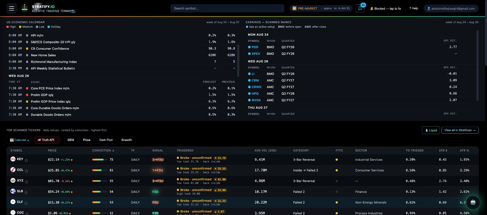
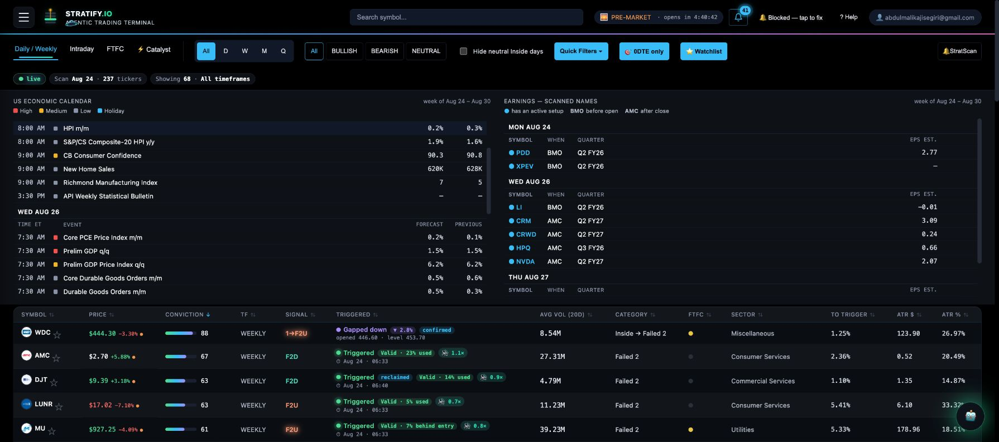
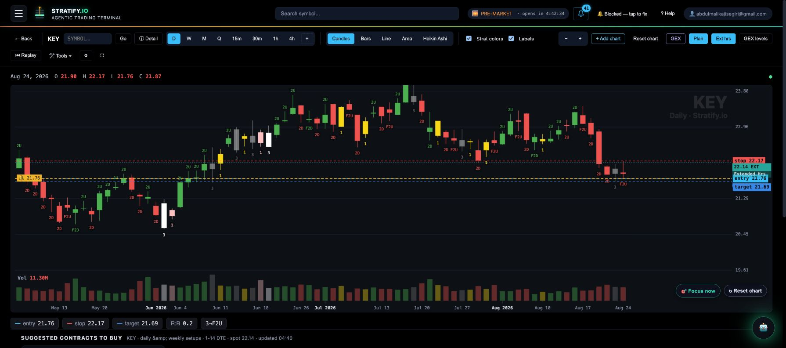
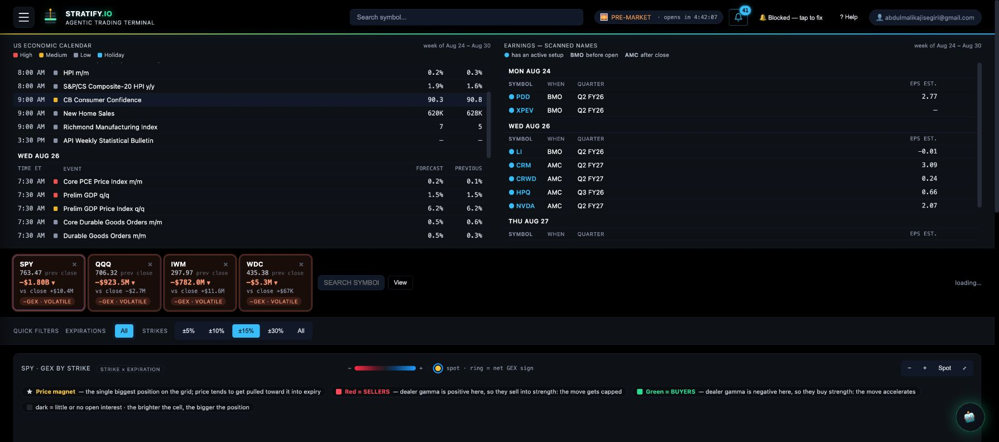
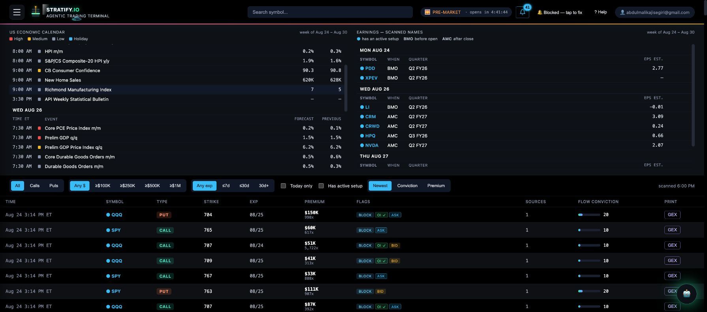
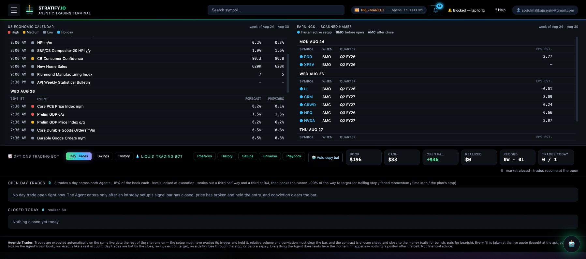
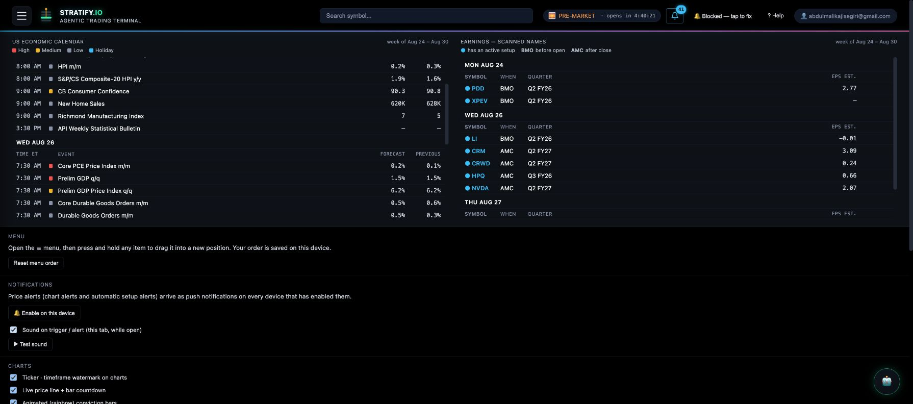
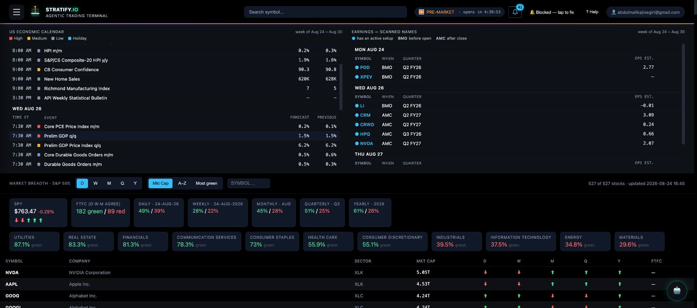

# StratScanner reference audit → QuantEdge

Captured August 25, 2026 from the live signed-in product at
`https://stratscanner.tail5028a3.ts.net/`. This is a product-pattern audit, not
permission to copy its branding, text, data, or proprietary setup rules.

## Executive read

StratScanner feels organised because it separates four jobs that QuantEdge often
compresses into one screen:

1. **Orient** — calendar, earnings, breadth, market state.
2. **Discover** — a dense ranked scanner with persistent columns and filters.
3. **Validate** — chart, setup geometry, GEX, flow, catalysts.
4. **Execute and audit** — explicit trigger gates, selected contract, bot book,
   fills, exits, history.

It does not win through more cards or more glow. It wins through stable page
grammar: thin global header, reorderable navigation, one page-level control strip,
one dominant data surface, contextual details below, and a short provenance/read
guide at the bottom.

## Captured surfaces

### 1. Home — orientation before ideas

Observed:

- Weekly economic calendar and scanned-name earnings share the first surface.
- Ranked setups use a table, not a wall of cards.
- Breadth, sector dollar-volume rotation, and news live below discovery—not as
  three competing hero panels.
- Quick bridges open Calendar, Truth API, GEX, Flow, Dark Pool, and Breadth.
- Every live/stale distinction is stated in copy.

QuantEdge adaptation:

- Oracle top becomes a **Market Operating Strip**: session, next risk event,
  SPY state, breadth, leading/lagging sector, data timestamp.
- Market Pulse is the summary. Rotation Map and Session Brief become drilldowns
  from it, not three equal overview cards.
- Early Rotation belongs directly above Active Signals as the discovery bridge.

### 2. StratScan — discovery

Observed columns:

- symbol, live price, conviction, timeframe, setup, trigger state;
- average volume, category, timeframe continuity, sector;
- distance to trigger and ATR in dollars/percent.

Important engine distinction:

- The visible score is explicitly a ranking aid.
- The real publication gate is separate: relative volume, options OI, flow
  agreement, trigger confirmation, and timeframe alignment.
- Untriggered and low-ranked records remain visible instead of disappearing.

QuantEdge adaptation:

- Cockpit gets a compact **Scanner view** alongside Focus and Grid.
- Columns: ticker, side, evidence band/raw points, setup, state, live/trigger,
  distance, structural T1, R:R, contract/liquidity, sector, freshness.
- Searching a ticker returns a scanner row in the same grammar. It must not create
  a fake Active Signal until publication requirements are met.

### 3. Charts — validation workspace

Observed:

- Timeframes: D/W/M/Q plus 15m/30m/1h/4h.
- Candles, bars, line, area, Heikin Ashi.
- Optional setup colours, labels, extended hours, GEX levels, replay, drawings,
  zoom, fullscreen, and multi-chart.
- A four-cell geometry strip—entry, stop, target, R:R—sits directly under the
  chart controls.
- Suggested contracts, unusual flow, and catalysts remain ticker-bound below.

QuantEdge adaptation:

- Build one shared `ResearchChartWorkspace` used by Oracle, Research, GEX, Flow,
  LEAPS, and Crypto.
- Preserve a single symbol/timeframe across modules.
- Put line/candle/Heikin toggles in one toolbar rather than per-page variants.
- Price Ladder becomes a chart overlay/drawer; the compact geometry strip remains
  visible at all times.

### 4. GEX — structure, not decoration

Observed:

- Watched symbols first show net GEX and change since close.
- Quick expiry and strike-range filters precede the heatmap.
- Separate strike × expiry and 0DTE strike × time surfaces.
- Plain-language legend explains magnet, sellers, buyers, intensity, floor,
  flip, and ceiling.

QuantEdge adaptation:

- Keep the existing true strike × expiry Prism; do not replace it with fake 3D.
- Add a compact watched-symbol rail and saved configurations.
- GEX context consumed by a signal must link to the exact symbol/expiry/strike
  evidence that contributed—not a generic GEX page.

### 5. Flow — evidence feed

Observed:

- Dense prints table with ticker, call/put, strike, expiry, premium, multiplier,
  bid/ask/block/OI flags, score, and one-click GEX.
- Flow is explicitly labelled positioning evidence, not a standalone signal.
- Multi-source recurrence and alignment with an active setup add confluence.

QuantEdge adaptation:

- Flow becomes `Sector → ticker → contract → print` with shared filters.
- Every print can open its ticker evidence canvas and exact GEX context.
- Oracle's Flow layer should expose the supporting prints and timestamps.

### 6. Agentic Trader — execution and audit

Observed:

- Day trades, swings, history, liquid positions/history/setups/universe/playbook,
  and auto-copy are one system with two clear agent families.
- Book, cash, open P&L, realised P&L, record, and daily trade count form one strip.
- Entry rules and exit policy are stated next to the book.
- It distinguishes scanner setups from executed positions.

QuantEdge adaptation:

- Bot must consume published Oracle signals but own a separate execution ledger.
- Restore historical bot wins only when imported as verified fills; never present
  Oracle outcomes as bot fills.
- Show which gate caused a skip: untriggered, chased, contract unavailable,
  liquidity, budget, event risk, or max positions.
- Discord should publish two event types: Oracle publication and Bot execution.

### 7. Settings — real user configuration

Observed:

- Reorderable menu persisted per user/device.
- Push notification enablement, sound test, chart preferences, and animated score
  preference.
- A settings optimiser searches recent graded history for expectancy in R rather
  than asking users to guess thresholds.

QuantEdge adaptation:

- User profile owns theme, account/risk budget, horizon budgets, menu order,
  default Oracle view, alert matrix, chart preferences, Discord identity, and
  community/watchlist identity.
- Provide Night Glass and Terminal Dark as token modes—not separate component
  implementations.

### 8. Breadth — independent market confirmation

Observed:

- Sector cards filter a large continuity table.
- Daily/weekly/monthly/quarterly/yearly direction stays visible per name.
- Breadth is described as an independent sanity check, not another signal score.

QuantEdge adaptation:

- Add timeframe continuity to Session Brief and signal evidence.
- Do not grant the same move five independent points merely because it appears
  in correlated breadth, sector, technical, and regime inputs.
- Display source/provenance and last refresh on every context contribution.

## Engine architecture QuantEdge should adopt

### Layer 1 — observations

Price, volume, options chain, GEX, flow, breadth, calendar, news, fundamentals.
Every observation carries source, as-of time, session, and data quality.

### Layer 2 — setup detectors

Bull/bear flags, compression, gap paths, failed breaks, reversals, trend pullbacks,
gamma structures, long-horizon theses. A detector describes a pattern; it does
not publish a trade.

### Layer 3 — evidence grade

Signed, de-correlated evidence: band S/A/B/C plus support/challenge points and
active layer count. Never present this as probability of profit.

### Layer 4 — publication gate

Direction, trigger, invalidation, structural target, minimum geometry, freshness,
event risk, and data integrity. Outputs `WATCH`, `READY`, `PUBLISHED`, or `VETO`
with reasons.

### Layer 5 — vehicle selection

Shares, long option, debit spread, or LEAPS. DTE, delta, spread, OI, volume,
premium budget, breakeven, IV/HV, and target repricing belong here—not in setup
quality.

### Layer 6 — execution lifecycle

Pending trigger → entered → scaled → stop moved → target/stop/time exit → closed.
Published setup history and paper/live bot fills remain separate ledgers.

### Layer 7 — calibration

Measure hit rate, realised R, MAE/MFE, time-to-trigger, time-to-target, expiry and
contract return by setup family, regime, side, horizon, liquidity, and score band.
Only this layer may eventually produce a calibrated probability.

## Design rules to carry across QuantEdge

1. One dominant question per page.
2. One persistent symbol context across modules.
3. One global filter grammar with page-specific additions.
4. Tables for comparison; canvases for analysis; cards only for summaries.
5. Expand details into a drawer/modal with background blur; do not duplicate the
   same content farther down the page.
6. Motion communicates data changes: rank movement, price updates, trigger state,
   flow arrival, and lifecycle transitions.
7. 3D is reserved for data with real depth—GEX surfaces, rotation history, and
   flow paths—not card chrome.
8. Every number states source, as-of time, and whether live/delayed/stale.

## Recommended QuantEdge page order

1. **Oracle** — orient + discover + focused evidence.
2. **Research** — ticker chart workspace and thesis.
3. **Flow** — options positioning feed.
4. **GEX / Prism** — dealer structure.
5. **LEAPS** — long-horizon thesis and contract timeline.
6. **Catalyst** — event timeline and scenario impact.
7. **Crypto** — underlying market plus tradable equity/option proxies.
8. **Bot** — execution, positions, history, playbooks.
9. **Performance** — signal validation and bot performance, separately.
10. **Account** — profile, risk, alerts, integrations, appearance, community.
